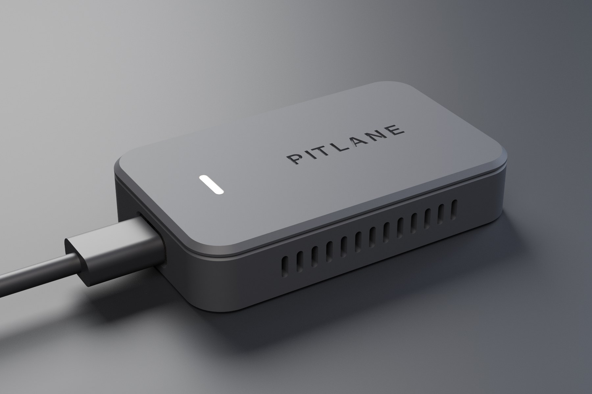
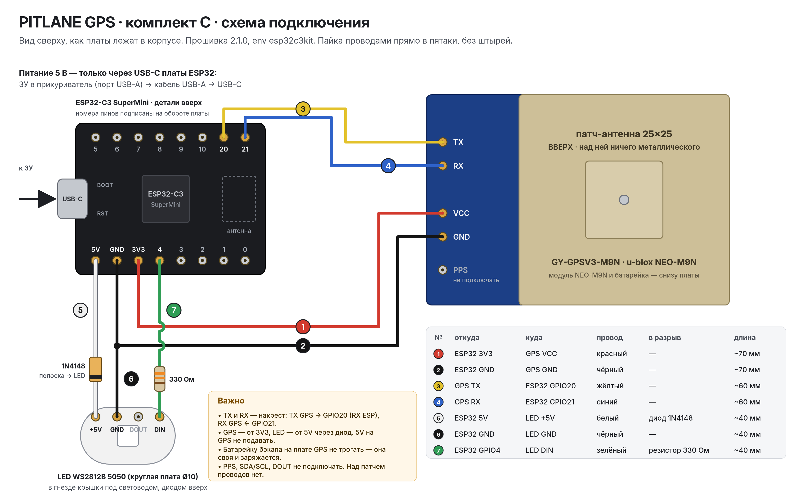

# PITLANE GPS — комплект C «USB от машины» (для сборщика)

Полный пакет: **PITLANE-GPS-kit.pdf** + **PITLANE-GPS-kit.zip** (собирает `python3 docs/kit/build_kit.py`).
Прошивка 2.1.0, env `esp32c3kit`. Корпус — [`../../enclosure/kit/`](../../enclosure/kit/), схема — [`pitlane-gps-kit-wiring.svg`](pitlane-gps-kit-wiring.svg).

## Список для заказа (ориентир, 10.10.2026)

| # | Деталь | Кол-во | Ориентир | На что не попасться |
|---|---|---|---|---|
| | **Электроника** | | | |
| 1 | Плата GNSS GY-GPSV3-M9N (u-blox NEO-M9N), с керамической патч-антенной 25×25 | 1 | 1 500–2 200 ₽ | На экране модуля должно быть «u-blox NEO-M9N-00B». «M9N» за 500–900 ₽ — почти всегда M8N или клон. GY-NEO6MV2/NEO-6M, ATGM336H, «BN-220» — 1–10 Гц, NMEA, прошивка их не поддерживает. GY-GPSV3-M8N (та же плата) — максимум 10 Гц. Проверка — лог при старте: «GNSS NEO-M9N-00B: UBX OK, rate 25 Hz». |
| 2 | ESP32-C3 SuperMini (USB-C, 22,5×18 мм, 2 ряда по 8 пинов) | 2 (1 + запас) | 210–500 ₽ /шт | Другие «C3 Mini/Core» (LuatOS 21×51, DevKitM) в карман 22,5×18 не войдут. У части плат слабый Wi-Fi и нет резисторов CC на USB-C — поэтому кабель USB-A→C и мощность Wi-Fi 8,5 дБм в прошивке; вторая плата — на случай брака. |
| 3 | Светодиод WS2812B 5050 на круглой мини-плате Ø10 мм, 5 В (набор 10 шт) | 1 набор (нужен 1 шт) | 85–150 ₽ | Не RGBW (SK6812 4-канальный), не «модуль 12 мм на проводах». Пятаки на обороте: 5V, GND, DIN, DOUT. |
| 4 | Диод 1N4148 (DO-35) | 1 (+запас) | 3–10 ₽ /шт | Полоска (катод) — к LED. |
| 5 | Резистор 330 Ом 0,25 Вт | 1 (+запас) | 3–10 ₽ /шт |  |
| 6 | Провод силиконовый 26 AWG, набор 6 цветов (красный, чёрный, жёлтый, синий, белый, зелёный) | ≈ 0,5 м на прибор | 750–1 200 ₽ | Не толще 24 AWG — не уложите, оторвёте пятаки. |
| 7 | Термоусадка 1,5 и 3 мм (набор) | ≈ 10 см | 150–300 ₽ |  |
| 8 | Скотч двусторонний вспененный 1 мм, акриловый клей (3M/Scotch, типа VHB) | ≈ 10 см | 150–400 ₽ | Не дешёвый на полиэтиленовой пене — в жару отклеится. |
| | **Питание в машине** | | | |
| 9 | Автомобильное ЗУ в прикуриватель с портами USB-A + USB-C (напр. Baseus 45 Вт CCMLC20C-01, UGREEN 42,5 Вт 60980) | 1 | 1 050–1 800 ₽ | Не «no-name» без защиты (шум и просадки на 5 В). Не только USB-C: с кабелем C–C часть плат SuperMini не получит питание (нет резисторов CC). |
| 10 | Кабель USB-A → USB-C угловой 90°, 1 м, с передачей данных (напр. UGREEN US284 50941) | 1 | 465–600 ₽ | Не «только зарядка» — компьютер не увидит плату. Литьё штекера ≤ 12,4×6,8 мм (окно корпуса 12,8×7,0). |
| | **Крепёж и крепление в салоне** | | | |
| 11 | Магнит неодимовый диск 10×2 мм N52 (никель) | 4 (+2) | 10–25 ₽ /шт | 10×3 не войдёт (карман 2,2 мм). Полярность не важна: магнит тянет сталь любой стороной. |
| 12 | Металлическая пластина для магнитного держателя телефона, самоклеящаяся (3M), ≥ 50×38 мм | 1 (+1) | 15–70 ₽ /шт | Клеить на обезжиренный пластик при ≥ +20 °C, полная прочность через 24 ч. |
| 13 | Суперклей-гель (цианоакрилат) | 1 | 100–200 ₽ | Не на лицевую сторону световода — помутнеет. |
| 14 | Саморез DIN 7982 ST2,2×9,5, потай, PH1, нерж. A2 | 4 (+2) | 2–5 ₽ /шт | Не M2 «по металлу» — в Ø1,9 под саморез не нарежет. |
| | **Пластик для печати** | | | |
| 15 | ASA 1,75 мм, чёрный или тёмно-серый (графит), 1 кг (Eryone / Elegoo / Bambu / eSUN) | ≈ 25 г на прибор | 1 450–3 400 ₽ | PETG на торпеду НЕ годится (размягчается ~75–80 °C, ведёт летом). PLA — нельзя совсем. ASA печатать в закрытом принтере. |
| 16 | PETG прозрачный (clear/natural) 1,75 мм | < 1 г | 1 050–1 500 ₽ | Световод закрыт крышкой со всех сторон, кроме лица 1,6×8,4 мм — прогрев ему не страшен. |
| | **Инструменты (если нет)** | | | |
| 17 | Паяльник 40–60 Вт с регулировкой, тонкое жало, припой 0,5–0,8 мм с флюсом, флюс | — | 1 000–3 000 ₽ |  |
| 18 | Мультиметр | — | 600–1 500 ₽ |  |
| 19 | Бокорезы, пинцет, стриппер, зажигалка/фен для термоусадки | — | 300–800 ₽ |  |
| 20 | Штангенциркуль | — | 300–1 000 ₽ |  |
| 21 | Компьютер с Chrome или Edge | — | — |  |

**Итого к оплате** ≈ 7 300–13 100 ₽ (упаковками, без инструментов); если пластик/провод/расходка есть — ≈ 3 650–6 100 ₽; уходит на 1 прибор ≈ 3 350–5 450 ₽. Таблица с аналогами и источниками цен — [`PITLANE-GPS-BOM.csv`](PITLANE-GPS-BOM.csv).

## Подключение

| № | Откуда | Куда | Провод | В разрыв |
|---|---|---|---|---|
| 1 | ESP32 3V3 | GPS VCC | красный | — |
| 2 | ESP32 GND | GPS GND | чёрный | — |
| 3 | GPS TX | ESP32 GPIO20 | жёлтый | — |
| 4 | GPS RX | ESP32 GPIO21 | синий | — |
| 5 | ESP32 5V | LED +5V | белый | диод 1N4148 (полоска к LED) |
| 6 | ESP32 GND | LED GND | чёрный | — |
| 7 | ESP32 GPIO4 | LED DIN | зелёный | резистор 330 Ом |

Пины = `platformio.ini [env:esp32c3kit]`, сверяет `test/kit.test.mjs`.

## Индикатор

| LED | Значит |
|---|---|
| фиолетовый плавный пульс | режим настройки Wi-Fi: сеть PITLANE-GPS-XXXX открыта (первый запуск или 3 включения подряд) |
| красный, двойная вспышка | нужна привязка: код не подошёл или прибор отвязан в Mini App → новая привязка |
| красный, часто мигает (4 раза в с) | нет данных от GPS-модуля: питание GPS, TX/RX перепутаны, холодная пайка |
| янтарный плавный пульс | GPS ищет спутники (холодный старт под открытым небом до ~30–60 с) |
| белый, короткая вспышка раз в 2 с | спутники есть, Wi-Fi ещё не настроен |
| белый, короткая вспышка раз в 1 с | спутники есть, ищу Режим модема iPhone |
| белый, мигает 1 раз в секунду | Wi-Fi есть, сервера нет: у телефона нет интернета или ждём привязку |
| белый, ровно (приглушённо) | всё готово: поток идёт в Mini App |
| белый, ровно и ярко | идёт замер (разгон) |
| не горит | нет питания (горит ли красный LED на самой плате ESP32?), диод стоит наоборот, перепутаны DIN/DOUT |

## Печать

ASA (основание 14.17 г / 1h 28m 59s, крышка 9.44 г / 1h 1m 18s), световод — прозрачный PETG. Без поддержек, STL уже повёрнуты. Сопло 0,4, слой 0,2, 4 периметра, 30 % гироид, закрытый принтер.

Подробно (сборка, прошивка, привязка, диагностика, оговорки) — в PDF.
