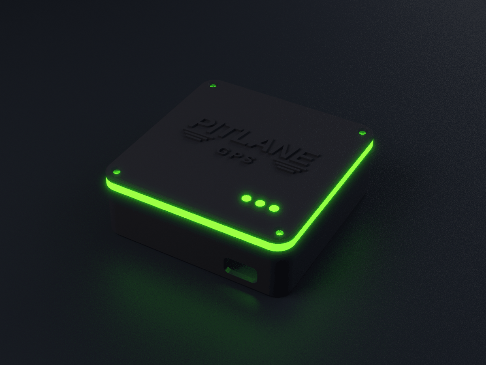
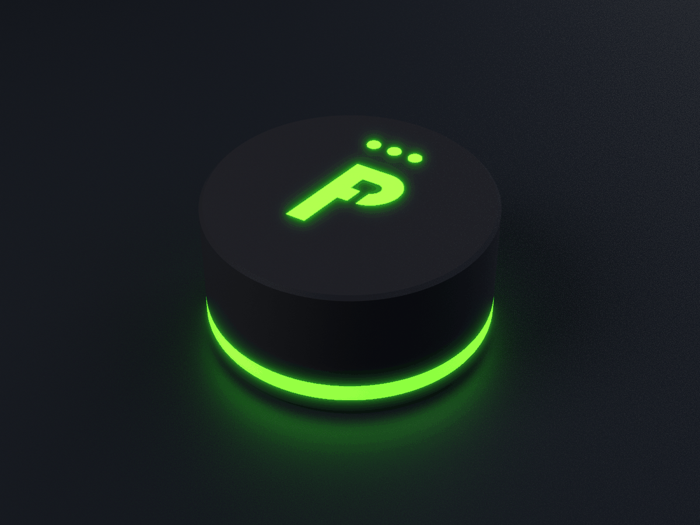

# PITLANE GPS: корпуса для 3D-печати

Два параметрических корпуса для самодельного GNSS-замерщика PITLANE GPS (электроника и прошивка лежат в [`../`](../README.md)).
Каждый корпус есть в двух вариантах антенны:

- **A**: внешняя активная антенна. В стенке отверстие под SMA-гнездо на панель (Ø6,5 мм с лыской 6,0 мм), внутри есть место под гайку.
- **B**: встроенный керамический патч 25×25 мм под верхней стенкой. Над патчем только пластик: нет ни ленты, ни винтов, ни проводов.

| | «Коробочка» | «Шайба» |
|---|---|---|
| Габарит | **70 × 70 × 25 мм** (с рельефом логотипа 25,8 мм), углы R6 | **Ø62 × 31,3 мм** |
| Разбивка по высоте | основание 20 + световое кольцо 3 + крышка 2 | нижняя крышка 4 + неоновое кольцо 3,9 + корпус 23,4 |
| Стенки | 2,0 мм, дно 2,0 мм, крышка 2,0 мм | 2,0 мм, верх 2,0 мм, крышка 4,0 мм (1,8 мм под магнитом) |
| Аккумулятор | 103450, 10×34×50 мм (+2 мм плата защиты) | **803040, 8×30×40 мм (+2 мм), 1000 мА·ч** |
| Крышка | 4 винта M2 с потайной головкой сверху | 4 винта M2 с потайной головкой снизу |
| Свет | световое кольцо по периметру между основанием и крышкой, 3 световода статуса | нижнее неоновое кольцо, световая «P» сверху, 3 световода статуса |

Превью: [`renders/`](renders/). Сборка в ¾, разрез с деталями внутри, разнесённый вид.




## Файлы

```
scad/parts.scad     размеры покупных деталей (с пометкой [ДОП] для допущений) и болванки
scad/box.scad       «коробочка»: part = body | lid | ring | pipes | assembly, ant = "A" | "B"
scad/puck.scad      «шайба»:     part = body | cover | ring | plogo | pipes | assembly
stl/box-A/  stl/box-B/  stl/puck-A/  stl/puck-B/   готовые STL, уже повёрнутые под печать
check.py            проверка сборки: пересечения, зазор ≥0,3 мм, толщина стенок → build/check_report.json
export_stl.py       пересобрать STL
make_renders.py + blender_render.py   превью (Blender Cycles)
```

Состав каждого комплекта STL:

| Файл | Материал | Что это |
|---|---|---|
| `*_body.stl` | PETG/ABS, чёрный | корпус. У A и B он разный: у A есть отверстие под SMA |
| `box-*_lid.stl` / `puck-*_cover.stl` | PETG/ABS, чёрный | крышка (у коробочки с рельефным PITLANE), нижняя крышка шайбы с выемкой под магнит |
| `*_lightring.stl` | прозрачный PETG | световод-кольцо: у коробочки по периметру, у шайбы снизу |
| `puck-*_P-lightguide.stl` | прозрачный PETG | буква «P» вместе с рассеивателем 3 мм, подсветка с торцов |
| `*_ledpipes.stl` | прозрачный PETG | 3 световода Ø3 мм для светодиодов статуса, соединены буртиком |

Пересобрать всё: `python3 check.py && python3 export_stl.py && python3 make_renders.py`
(нужны `openscad`, `pip install trimesh manifold3d scipy networkx rtree`, а для превью ещё `blender`).
Размеры меняются в `parts.scad`: например, если плата GPS длиной 35 мм, а не 36, или аккумулятор другой.
После любой правки запускайте `check.py`.

## Размеры деталей и источники

Модель строится по этим числам. Всё, что помечено **[ДОП]**, не взято из даташита, а заложено мной как запас или допущение. Такие размеры лучше померить штангенциркулем на своей детали и при необходимости поправить в `scad/parts.scad`.

| Деталь | Заложено в модель | Источник |
|---|---|---|
| **GNSS: GY-GPSV3-M9N** (u-blox NEO-M9N), распространённая breakout-плата | плата **25 × 36 мм** (у большинства продавцов 25×35, у TinyTronics 36×25: заложено 36); патч 25×25 на плате; отверстие Ø3; питание 3–5 В; UART 38400 | [ligadosnasdicas.com.br](https://ligadosnasdicas.com.br/High-Precision-GPSV3-M9N-NEO-M9N-GPS-Module-With-Ceramic-Patch-301400/), [mobilyahane.com.tr (описание лота)](https://www.mobilyahane.com.tr/premium_Boutique_365839); [TinyTronics](https://www.tinytronics.nl/en/communication-and-signals/wireless/gps/modules/gy-gpsv3-neo-m9n-gnss-gps-module): 36×25 по выдаче поиска, сама страница закрыта Cloudflare, я её не открыл |
| модуль NEO-M9N на плате | 16,0 × 12,2 × 2,4 мм (max 2,6) → **[ДОП]** детали снизу платы ≤3,0 мм, а полоса 2 мм у длинных краёв свободна (плата лежит на ней) | [u-blox NEO-M9N-00B Data sheet UBX-19014285, табл. 20](https://content.u-blox.com/sites/default/files/NEO-M9N-00B_DataSheet_UBX-19014285.pdf) |
| керамический патч | 25 × 25 × **4** мм (толщина патча GY-платы не опубликована, взят типоразмер 25×25×4); в модели он занимает всю плату | [Taoglas CGGP.25.4](https://www.taoglas.com/datasheets/CGGP.25.4.E.02.pdf) |
| PCB GPS | **[ДОП]** 1,6 мм; у варианта A детали сверху (U.FL и т. п.) ≤2,5 мм | — |
| **ESP32-C3 SuperMini** | 22,52 × 18 мм; **[ДОП]** с USB-C 24 мм, высота 4,3 мм | [даташит SuperMini (artronshop)](https://dl.artronshop.co.th/ESP32-C3%20SuperMini%20datasheet.pdf), [espboards.dev](https://www.espboards.dev/esp32/esp32-c3-super-mini/) |
| **TP4056 USB-C** с защитой DW01A+FS8205A | 26 × 17 × 4 мм; **[ДОП]** гнездо USB-C 8,94×7,35×3,26 мм выступает за плату на 1,5 мм. Бывают платы 25×19 мм: они в эту модель **не** встанут | [masterlexon (26×17×4)](https://masterlexon.com/en/li-ion-1s-tp4056-type-c-charge-discharge-module), [javanelec PDF (26×17)](https://www.javanelec.com/stfiles/getappdocument/1/true/5979e760-dc7f-4974-b169-cc933639db73.pdf), [25×19 вариант](https://technolabelectronics.com/?product=tp4056-1a-li-ion-lithium-battery-charging-module-with-current-protection-type-c) |
| **LiPo 103450** (коробочка) | 10 × 34 × 50 мм, с платой защиты +2 мм по длине. Внимание: у 103450 номинал обычно **1800–2000 мА·ч**, а не 1200. Ячейка 1200 мА·ч из основного BOM (103040, 10×30×40) тоже помещается | [THOR-103450](https://thorbattery.com/product/thor-103450/), [LP103450 1800 мА·ч](https://www.lipobattery.us/product/lp103450-3-7v-1800mah-6-66wh/), [103040 1200 мА·ч (axeum)](https://norilsk.axeum.ru/product/akb-universalnaja-103040p-37v-li-pol-1200-mah-103040-mm) |
| **LiPo 803040** (шайба) | 8 × 30 × 40 мм, с платой защиты до 42 мм, **1000 мА·ч** | [HNF 803040](https://hnfbattery.com/product/803040-3-7v-lipo/), [THOR-803040](https://thorbattery.com/product/thor-803040/) |
| **SS12D00G4** | корпус L8,8 × W3,9 × H7,2 мм, рычаг G4 = 4,0 мм, ход 3,5 мм (у части продавцов 2,0); **[ДОП]** сечение рычага ≤2×2 мм | [Sofng SS-12D00 (LCSC PDF)](https://file.icallin.com/static/lcsc/documents/2026-01-27/6402f08e338c80bb8688b5e0c20705c0.pdf), [voltiq.ru](https://voltiq.ru/shop/slide-switch-ss-12d00g4/), [sainapse (8,5×3,7×11,2 в сборе)](https://sainapse.com.my/ss12d00g4-on-off-button-switch) |
| **SMA-гнездо на панель** 1/4"-36 | вырез Ø6,5 с лыской 6,0, панель ≤2,8 мм (стенка 2,0 / 2,4 с площадкой); гайка 8 мм под ключ (типовая); **[ДОП]** внутри нужна огибающая 11 мм | [Würth 65503503230501, Recommended Panel Cutout](https://www.we-online.com/components/products/datasheet/65503503230501.pdf) |
| светодиоды статуса | 3 мм (буртик Ø3,8, высота 5,3) под световодами | — |
| лента по периметру | **[ДОП]** ширина ≤5 мм, толщина ≤1,6 мм (например, WS2812B-2020 5 мм) | — |
| магнит (шайба) | выемка Ø20,4 × 2,2 мм под неодимовый диск Ø20×2 или силиконовый диск-присоску Ø20 | — |

### Почему шайба Ø62 и почему 803040

- **Что определяет диаметр.** Средний слой: TP4056 (26×17) разъёмом USB-C к стенке. Угол платы оказывается на радиусе 28,6 мм, плюс нужен зазор 0,4 мм, поэтому внутренний радиус 29 мм, а со стенкой 2 мм получается Ø62. Это внутри заданных 60–65 мм.
- **Почему не 103450.** С платой защиты это 52×34 мм, диагональ 62,1 мм. Чтобы он лёг с зазором, нужна шайба не меньше **~Ø67**.
- **Что выбрано.** Для шайбы взят **803040 (8×30×40 мм, 1000 мА·ч)**. Если хочется 1200 мА·ч, подойдёт 103040 (10×30×40): у него та же площадь, но он на 2 мм толще. В `parts.scad` поставьте `BAT_PUCK = [42, 30, 10]`, и шайба станет на 2 мм выше. Эту версию я не собирал и не проверял.

## Как всё уложено

**Коробочка** (вид сверху, USB-C спереди):

- **GPS** лежит спереди слева на двух рейках, низ платы на высоте 5,5 мм, с торцов упоры. В варианте B патч смотрит вверх, над ним 12 мм воздуха и крышка. Лента над платой не проходит: передний отрезок ленты стоит только справа.
- **TP4056** спереди справа на рёбрах. USB-C выходит в окно 12,4×6,6 мм, в которое проходит корпус вилки. Задний упор не даёт плате уехать, когда вставляют вилку.
- **АКБ 103450** лежит сзади на дне. **ESP32** приклеен сверху на АКБ вспененным скотчем.
- **Выключатель** стоит на левой стенке над АКБ в карманчике из щёчек и опорного блока, рычаг выходит наружу на 2 мм. У варианта A на левой стенке спереди ещё SMA.
- **Световое кольцо** зажато между основанием и крышкой. Внутренняя юбка кольца (1,6 мм) заходит в основание: к ней изнутри клеится лента, свет проходит в видимый пояс 3 мм. Три световода стоят в крышке над TP4056, то есть не над GPS.

**Шайба** (снизу вверх):

1. Нижняя крышка с магнитом.
2. Прозрачное кольцо, внутри 4 светодиода.
3. АКБ 803040.
4. TP4056 (USB-C сбоку) и ESP32 на скотче.
5. GPS между двумя поперечными стенками кармана, патчем вверх.
6. Рассеиватель 3 мм с буквой «P»: подсветка двумя светодиодами с торцов, в стороне от патча.
7. Верх.

Выключатель стоит сзади на +Y, рычаг выходит наружу всего на ~1,3 мм. SMA варианта A стоит спереди на −Y, на уровне GPS. Три световода статуса расположены над выключателем, вне кармана GPS.

Внутренние координаты (мм, от низа изделия) задаются в начале `box.scad` / `puck.scad`. Для шайбы: АКБ 4–12, средний слой 12,5–16,8, детали под GPS 17,3–20,3, плата GPS 20,3–21,9, патч до 25,9, рассеиватель 26,3–29,3, верх 29,3–31,3.

## Проверка сборки (`check.py`)

Что делает скрипт: собирает все детали и грубые болванки электроники (прямоугольники по габаритам из таблицы выше) и через manifold3d считает объёмы пересечений:

- деталь × деталь;
- болванка, раздутая на **0,3 мм** × деталь. Раздувание не делается вниз там, где деталь лежит на опоре;
- болванка × болванка.

Результат: **все 4 варианта OK**. Пересечений нет, от каждой болванки до пластика не меньше 0,3 мм. Посадочные зазоры в карманах заложены 0,4 мм, в пазах 0,3–0,5 мм.

Толщина стенок проверялась так: 40 000 лучей внутрь по нормали на каждую деталь, отчёт в [`check_report.json`](check_report.json) (при запуске пишется в `build/`). Минимум 1,6 мм у корпусов, колец, нижней крышки и световодов. Тоньше 1,6 мм только:

- рельеф логотипа на крышке коробочки: штрихи букв и «линии скорости» 0,9–1,5 мм, это декор, а не стенка;
- кромки выреза USB-C и отверстия SMA в круглой стенке шайбы: там по кромке неизбежен клин;
- острый угол наклонной «P».

## Печать

Все STL уже повёрнуты как надо и ставятся на стол как есть. **Поддержки не нужны.**

| Деталь | Как лежит | Материал / настройки |
|---|---|---|
| корпус коробочки | дном вниз | **PETG** или **ABS/ASA**, чёрный; слой 0,2; 4 периметра (стенка 2 мм); заполнение 20–25 % (гироид); верх/низ 5 слоёв |
| крышка коробочки | логотипом вверх | то же; для чёткого рельефа можно 0,12–0,16 мм на последних слоях |
| корпус шайбы | верхом (с «P») на стол | то же. Окно USB-C (12,4 мм) и паз выключателя печатаются мостом; косынки бобышек сделаны под 45° |
| крышка шайбы | плоской стороной вниз | то же; заполнение 30 % (на ней держится магнит) |
| световоды (кольца, «P», пайпы) | как в файле | **прозрачный (natural) PETG**; заполнение **100 %**; слой 0,2; скорость ~30 мм/с; температура выше обычной на 5–10 °C (так меньше пузырей и мутности); обдув 30–50 %. Кольцо шайбы лежит поясом вниз, фаска внутреннего фланца 45° |

- **В машине.** Летом на торпеде PETG может размякнуть (≈75–80 °C). Если корпус будет лежать под лобовым стеклом, печатайте его из **ASA/ABS**.
- **SMA в варианте A.** Отверстие Ø6,5 печатается в вертикальной стенке. Если провисла верхняя кромка, пройдите сверлом 6,5 мм.
- **Первая проба.** Сначала напечатайте только корпус и примерьте TP4056, GPS и выключатель: размеры с пометкой [ДОП] могут не совпасть с вашими платами.

## Крепёж и мелочи

| Что | Коробочка | Шайба |
|---|---|---|
| Винты крышки | 4 × **M2×10 с потайной головкой** (DIN 965 / ISO 7046), нарезают резьбу в отверстии Ø1,6 бобышки; можно саморез 2,2×9,5 потай (DIN 7982) | 4 × **M2×10 потай**, снизу через крышку в бобышки |
| Ножки / основание | 4 самоклеящиеся резиновые ножки Ø8–10 мм | неодимовый магнит **Ø20×2 мм** на клей, либо силиконовая присоска/нескользящий диск Ø20 в ту же выемку; можно наклеить силиконовый коврик на всё дно |
| Свет | отрезки ленты ≤5 мм шириной (сзади, справа, слева по ~48 мм, спереди 15 мм только в B) + 3 светодиода 3 мм | 4 SMD-светодиода или отрезки ленты для кольца, 2 для «P», 3 × 3 мм для статуса |
| Антенна A | SMA-гнездо на панель + пигтейл U.FL→SMA, активная GNSS-антенна SMA | то же |
| Прочее | вспененный двусторонний скотч 0,5–1 мм, термоклей, провода 26–30 AWG, термоусадка | + двусторонний скотч 0,4 мм (патч к рассеивателю), вспененный скотч 1 мм между слоями |

> Про светодиоды: прошивка сейчас управляет только встроенным светодиодом ESP32 (GPIO8).
> Лента, кольцо, «P» и три светодиода статуса — это место под них в корпусе. Схему их подключения и код я не делал.

## Порядок сборки

Электрическая схема та же, что в [основном README](../README.md#2-подключение): TP4056 OUT+ → выключатель → 5V ESP32. Батарею заряжают **только через USB-C платы TP4056**, это единственный разъём, выведенный наружу. Разъём USB-C на ESP32 остаётся внутри, для прошивки откройте крышку и выключите питание.

**Коробочка**

1. Спаяйте схему на столе, прошейте и проверьте ESP32.
2. Вставьте выключатель в карман на левой стенке рычагом в паз, закрепите каплей термоклея.
3. Вставьте TP4056 на рёбра и сдвиньте вперёд, пока USB-C не выйдет в окно. Проверьте, что вилка входит до конца, затем закрепите термоклеем.
4. Положите GPS на рейки, в варианте B патчем вверх. В варианте A: SMA-гнездо через стенку снаружи, лыской по вырезу, гайку затяните изнутри, пигтейл подключите к U.FL платы.
5. Положите АКБ на дно сзади на вспененный скотч, ESP32 приклейте сверху на АКБ. Уложите провода так, чтобы они не ложились над патчем (B).
6. Наклейте ленту на внутреннюю юбку кольца: сзади, справа, слева и спереди справа. В варианте B над GPS ленты нет.
7. Вставьте световоды снизу в отверстия крышки, под ними поставьте светодиоды.
8. Поставьте кольцо на основание и крышку на кольцо, затяните 4 винта M2×10 без усилия: это резьба в пластике.

**Шайба**

1. Положите корпус верхом вниз. Вставьте световод «P» изнутри так, чтобы буква вошла в прорезь и встала заподлицо (рассеиватель встаёт между стенками кармана), затем световоды статуса. Приклейте 2 светодиода подсветки к торцам рассеивателя.
2. Вставьте GPS в карман между стенками патчем к рассеивателю на скотче 0,4 мм. В варианте A платы без патча используйте вспененный скотч ~2 мм. Для варианта A поставьте SMA в стенку на площадку, гайку изнутри.
3. Выключатель вставьте между щёчками рычагом в паз, закрепите термоклеем.
4. TP4056 поставьте разъёмом в окно USB-C, ESP32 рядом, оба на вспененном скотче.
5. Сверху (изделие всё ещё перевёрнуто) положите АКБ 803040 на скотч.
6. Приклейте 4 светодиода кольца на нижнюю крышку, наденьте прозрачное кольцо, поставьте крышку. Стопка слоёв поджимается крышкой.
7. Затяните 4 винта M2×10 снизу, вклейте магнит или присоску.

## Что не проверено

- **Реальная печать и сборка не делались.** Проверка только в CAD на болванках по размерам из таблицы.
- Размеры с пометкой [ДОП] не измерены: высота деталей под платой GPS, свободная полоса у краёв, толщина патча, вынос USB-C за плату, сечение рычага выключателя, длина SMA внутри.
- Подойдут ли конкретные платы с AliExpress, не проверено: встречаются TP4056 25×19 и платы GPS другого размера.
- Как радиочасть работает внутри корпуса, не проверено: приём патча под 2 мм PETG/ABS с рассеивателем, BLE ESP32 рядом с АКБ. Под рассеивателем с «P» патч может немного расстроиться.
- Светоотдача колец и «P» из прозрачного PETG при торцевой подсветке не проверена, как и нагрев в машине.
- Вариант A имеет смысл, только если у платы GPS есть U.FL (или патч отключается). Какие размеры у таких версий платы 25×35/36, я не проверял.
