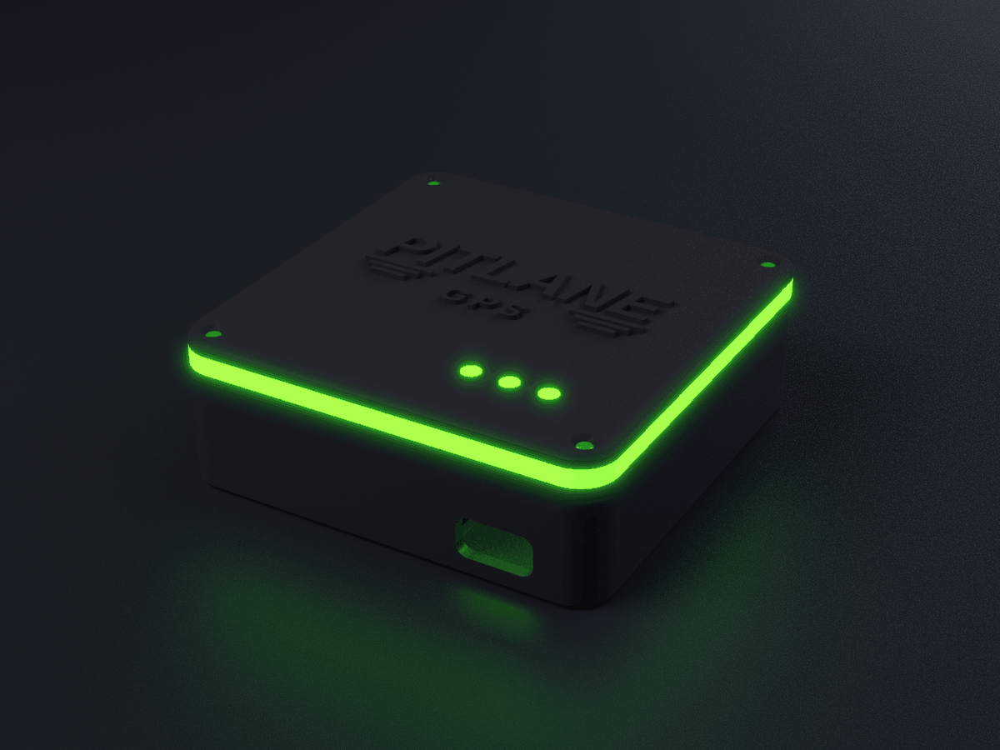
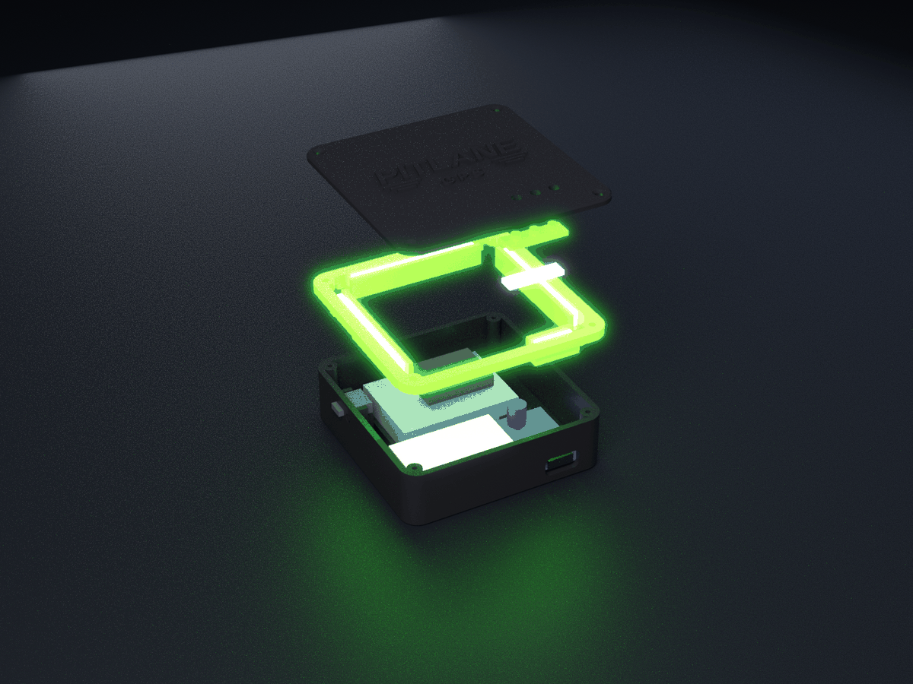

# PITLANE GPS: корпус «коробочка» 70×70×25 для 3D-печати

**Основной вариант — «коробочка», антенна B**: патч-антенна на плате GPS внутри, корпус цельный, как у Dragy.
Вариант **A** (SMA-гнездо в стенке под внешнюю антенну) оставлен запасным: те же исходники, `ant = "A"`.
«Шайба» Ø62 — архив, файлы лежат рядом (`scad/puck.scad`, `stl/puck-*`), в новых правках не участвовала.

Электроника, схема и прошивка — в [`../README.md`](../README.md). Готовый набор для печати: STL варианта B,
инструкция и схема — архив `pitlane-gps-box-print.zip` (собирается из этой папки).




| | «Коробочка», вариант B |
|---|---|
| Габарит | **70 × 70 × 25 мм** (с рельефом логотипа 25,8), углы R6 |
| Детали | основание 20 мм (чёрный) + световое кольцо 3 мм видимого пояса (прозрачный) + крышка 2 мм (чёрный) + планка световодов статуса (прозрачный) |
| Стенки | 2,0 мм, дно 2,0, крышка 2,0, стенки канала ленты 1,6 |
| Аккумулятор | **LiPo 103040, 1200 мА·ч** (10×30×40 + 2 мм плата защиты) |
| Подсветка | адресная лента **WS2812B-2020, 5 мм, 160 LED/м**: 23 LED по периметру в канале кольца + 3 LED статуса под крышкой, одна линия данных |
| Крышка | 4 винта M2×10 потай сверху |
| Выключатель | SS12D00G4 на левой стенке, рычаг наружу на 1,6 мм, гравировка «O / I» |
| Зарядка | USB-C платы TP4056 в передней стенке |

Ещё превью: [`renders/box_B_open_top.png`](renders/box_B_open_top.png) (без крышки, видно ленту в канале),
[`renders/box_B_section.png`](renders/box_B_section.png) (разрез). Старые превью A и шайбы — там же.

## Файлы

```
scad/parts.scad     размеры покупных деталей ([ДОП] = допущение) и болванки
scad/box.scad       коробочка: part = body | ring | lid | pipes | assembly, ant = "B" | "A"
scad/puck.scad      шайба (архив)
stl/box-B/          ОСНОВНОЙ комплект, уже повёрнут под печать
stl/box-A/          запасной (SMA)
stl/puck-A|B/       архив
check.py            проверка: пересечения, зазор ≥0,3 мм до болванок, толщина стенок → build/check_report.json
export_stl.py       пересобрать STL
make_renders.py + blender_render.py   превью (Blender Cycles), задачи v2_lit v2_exp v2_open v2_sec
```

| Файл (`stl/box-B/`) | Материал | Что это |
|---|---|---|
| `pitlane-box-B_body.stl` | PETG/ASA, чёрный | основание: рейки GPS, рёбра TP4056, упоры АКБ, карман выключателя с «O / I», окно USB-C |
| `pitlane-box-B_lightring.stl` | **прозрачный PETG** | световое кольцо: видимый пояс 3 мм + U-каналы под ленту по 4 сторонам |
| `pitlane-box-B_lid.stl` | PETG/ASA, чёрный | крышка с рельефом PITLANE GPS, 3 отверстия Ø3,3 под световоды статуса |
| `pitlane-box-B_ledpipes.stl` | **прозрачный PETG** | планка 20×6×1,6 с тремя световодами Ø3 (шаг 6,25 = шаг ленты) |

Пересобрать: `python3 check.py && python3 export_stl.py && python3 make_renders.py renders v2_lit v2_exp v2_open v2_sec`
(нужны `openscad`, `pip install trimesh manifold3d scipy networkx rtree`, для превью — `blender`).

## Подсветка в корпусе

Одна лента WS2812B-2020 (5 мм, 160 LED/м, шаг 6,25 мм), порезанная на 5 отрезков, соединённых проводами в цепочку:

| # в цепочке | Отрезок | Где | Длина |
|---|---|---|---|
| 0–2 | 3 LED статуса: GNSS, BLE, батарея | под планкой световодов в крышке, диодами вверх (справа налево, x = 20,5 / 14,25 / 8 мм) | 18,75 мм |
| 3–4 | кольцо спереди-справа | канал над TP4056 (над патчем GPS ленты нет) | 12,5 мм |
| 5–11 | кольцо справа | канал | 43,75 мм |
| 12–18 | кольцо сзади | канал | 43,75 мм |
| 19–25 | кольцо слева | канал (над карманом выключателя — без дна, лента держится на скотче) | 43,75 мм |

Всего 26 LED = 16,25 см ленты. В варианте A слева 5 LED (31,25 мм, SMA мешает), спереди 7 — в прошивке `-DLEDS_COUNT=29`.

**Крепление ленты.** Прозрачное кольцо снизу имеет по каждой стороне U-канал: наружная стенка — продолжение юбки кольца (1,6 мм),
дно 1,6 мм на высоте 15,6–17,2 мм, внутренняя стенка 1,6 мм до самой крышки. Лента стоит «на ребре» диодами **наружу**,
тыльной стороной на двусторонний скотч к внутренней стенке канала (зазор под скотч 0,6 мм), снизу опирается на дно (0,4 мм),
сверху до крышки 0,4 мм, до юбки 0,4 мм. Свет идёт в юбку и прямо в видимый пояс кольца. Каналы на 1,5 мм длиннее отрезков.

**Выход проводов.** Каналы открыты с торцов, а углы юбки вырезаны (там бобышки винтов): перемычки между отрезками
(3 провода 28–30 AWG) идут по углам, внутри корпуса над АКБ. Провод от ESP32 (GPIO4 → 330 Ом → DIN) и питание идут к
началу цепочки — статусному отрезку над TP4056; конденсатор 220 мкФ стоит там же (в модели Ø6,3×7,5, над TP4056, до ленты
и крышки зазор ≥0,3 мм). Над патчем GPS (перед-лево) провода не укладывать.

**Выключатель.** Рычаг SS12D00G4 выходит в паз 6,5×2,6 мм на левой стенке; рядом гравировка 0,4 мм «O» (к передней стенке)
и «I» (к задней). Распаяйте выключатель так, чтобы «включено» было при рычаге к «I». Светится ли прибор, видно по кольцу,
поэтому отдельного световода для выключателя нет.

## Как всё уложено (вид сверху, USB-C спереди)

- **GPS** — спереди слева на двух рейках, низ платы на 5,5 мм, торцевые упоры; патч вверх, над ним ~12 мм воздуха и 2 мм крышки.
  Над патчем нет ни ленты, ни винтов, ни проводов.
- **TP4056** — спереди справа на рёбрах, USB-C в окно 12,4×6,6 мм, задний упор держит плату при втыкании вилки.
- **АКБ 103040** — по центру сзади на дне (x −21…21, y −3,8…26,2), торцевые и задний упоры высотой 3 мм.
- **ESP32-C3** — на вспененном скотче сверху на АКБ.
- **Выключатель** — на левой стенке в кармане из щёчек и опорного блока.
- **Кольцо** зажато между основанием и крышкой, его каналы с лентой висят внутри по периметру (z 15,6–23).
- **Статусная планка** — в крышке над TP4056, лента из 3 LED приклеена к её низу.

## Размеры деталей и источники

Модель строится по этим числам. Всё, что помечено **[ДОП]**, не взято из даташита, а заложено мной как запас или допущение. Такие размеры лучше померить штангенциркулем на своей детали и при необходимости поправить в `scad/parts.scad`.

| Деталь | Заложено в модель | Источник |
|---|---|---|
| **GNSS: GY-GPSV3-M9N** (u-blox NEO-M9N), распространённая breakout-плата | плата **25 × 36 мм** (у большинства продавцов 25×35, у TinyTronics 36×25: заложено 36); патч 25×25 на плате; отверстие Ø3; питание 3–5 В; UART 38400 | [ligadosnasdicas.com.br](https://ligadosnasdicas.com.br/High-Precision-GPSV3-M9N-NEO-M9N-GPS-Module-With-Ceramic-Patch-301400/), [mobilyahane.com.tr (описание лота)](https://www.mobilyahane.com.tr/premium_Boutique_365839); [TinyTronics](https://www.tinytronics.nl/en/communication-and-signals/wireless/gps/modules/gy-gpsv3-neo-m9n-gnss-gps-module): 36×25 по выдаче поиска, сама страница закрыта Cloudflare, я её не открыл |
| модуль NEO-M9N на плате | 16,0 × 12,2 × 2,4 мм (max 2,6) → **[ДОП]** детали снизу платы ≤3,0 мм, а полоса 2 мм у длинных краёв свободна (плата лежит на ней) | [u-blox NEO-M9N-00B Data sheet UBX-19014285, табл. 20](https://content.u-blox.com/sites/default/files/NEO-M9N-00B_DataSheet_UBX-19014285.pdf) |
| керамический патч | 25 × 25 × **4** мм (толщина патча GY-платы не опубликована, взят типоразмер 25×25×4); в модели он занимает всю плату | [Taoglas CGGP.25.4](https://www.taoglas.com/datasheets/CGGP.25.4.E.02.pdf) |
| PCB GPS | **[ДОП]** 1,6 мм; у варианта A детали сверху (U.FL и т. п.) ≤2,5 мм | — |
| **ESP32-C3 SuperMini** | 22,52 × 18 мм; **[ДОП]** с USB-C 24 мм, высота 4,3 мм | [даташит SuperMini (artronshop)](https://dl.artronshop.co.th/ESP32-C3%20SuperMini%20datasheet.pdf), [espboards.dev](https://www.espboards.dev/esp32/esp32-c3-super-mini/) |
| **TP4056 USB-C** с защитой DW01A+FS8205A | 26 × 17 × 4 мм; **[ДОП]** гнездо USB-C 8,94×7,35×3,26 мм выступает за плату на 1,5 мм. Бывают платы 25×19 мм: они в эту модель **не** встанут | [masterlexon (26×17×4)](https://masterlexon.com/en/li-ion-1s-tp4056-type-c-charge-discharge-module), [javanelec PDF (26×17)](https://www.javanelec.com/stfiles/getappdocument/1/true/5979e760-dc7f-4974-b169-cc933639db73.pdf), [25×19 вариант](https://technolabelectronics.com/?product=tp4056-1a-li-ion-lithium-battery-charging-module-with-current-protection-type-c) |
| **LiPo 103040** (коробочка, основной) | **10 × 30 × 40 мм**, с платой защиты +2 мм по длине → в модели 42×30×10, упоры на дне. Запасной 103450 (10×34×50, обычно 1800–2000 мА·ч) тоже влезает: `BAT_BOX = [52, 34, 10]` в `parts.scad`, упоры сдвинутся сами | [THOR-103450](https://thorbattery.com/product/thor-103450/), [LP103450 1800 мА·ч](https://www.lipobattery.us/product/lp103450-3-7v-1800mah-6-66wh/), [103040 1200 мА·ч (axeum)](https://norilsk.axeum.ru/product/akb-universalnaja-103040p-37v-li-pol-1200-mah-103040-mm) |
| **LiPo 803040** (шайба) | 8 × 30 × 40 мм, с платой защиты до 42 мм, **1000 мА·ч** | [HNF 803040](https://hnfbattery.com/product/803040-3-7v-lipo/), [THOR-803040](https://thorbattery.com/product/thor-803040/) |
| **SS12D00G4** | корпус L8,8 × W3,9 × H7,2 мм, рычаг G4 = 4,0 мм, ход 3,5 мм (у части продавцов 2,0); **[ДОП]** сечение рычага ≤2×2 мм | [Sofng SS-12D00 (LCSC PDF)](https://file.icallin.com/static/lcsc/documents/2026-01-27/6402f08e338c80bb8688b5e0c20705c0.pdf), [voltiq.ru](https://voltiq.ru/shop/slide-switch-ss-12d00g4/), [sainapse (8,5×3,7×11,2 в сборе)](https://sainapse.com.my/ss12d00g4-on-off-button-switch) |
| **SMA-гнездо на панель** 1/4"-36 | вырез Ø6,5 с лыской 6,0, панель ≤2,8 мм (стенка 2,0 / 2,4 с площадкой); гайка 8 мм под ключ (типовая); **[ДОП]** внутри нужна огибающая 11 мм | [Würth 65503503230501, Recommended Panel Cutout](https://www.we-online.com/components/products/datasheet/65503503230501.pdf) |
| **лента WS2812B-2020** 5 мм, 160 LED/м | ширина 5 мм, шаг 6,25 мм (резать можно между любыми LED), светодиод 2,0×2,0×0,84 мм; **[ДОП]** толщина с FPC и скотчем ≤1,6 мм | [Worldsemi WS2812B-2020 (LCSC C965555)](https://www.lcsc.com/product-detail/C965555.html), [BTF-LIGHTING 5 мм 160 LED/м](https://www.btf-lighting.com/products/ws2812b-5mm-ultra-narrow-led-strip-160leds-5v) |
| конденсатор 220 мкФ 10 В | 6,3 × 7 мм, в модели болванка Ø6,3×7,5 над TP4056 | [Чип и Дип](https://www.chipdip.ru/product/ecap-k50-35-mini-220mkf-10v-6x7mm-jb-capacitors-33102) |
| светодиоды статуса (только шайба) | 3 мм (буртик Ø3,8, высота 5,3) | — |
| магнит (шайба) | выемка Ø20,4 × 2,2 мм под неодимовый диск Ø20×2 или силиконовый диск-присоску Ø20 | — |


## Проверка сборки (`check.py`)

Скрипт собирает детали и болванки электроники (коробки по габаритам из таблицы: GPS + детали снизу + патч, TP4056 + USB-C,
АКБ, ESP32, выключатель + рычаг с ходом, 5 отрезков ленты, конденсатор, для A — SMA) и через manifold3d считает объёмы:

- деталь × деталь (основание, кольцо, крышка, планка световодов);
- болванка, раздутая на **0,3 мм** × каждая деталь (вниз не раздувается там, где деталь лежит на опоре);
- болванка × болванка;
- толщина стенок: 40 000 лучей внутрь по нормали на деталь.

Результат 27.09.2026: **box-B OK, box-A OK** (и архивные puck-A/B OK). Пересечений нет, от каждой болванки до пластика ≥0,3 мм.
Минимальная толщина 1,6 мм у основания, кольца (включая каналы) и планки. Тоньше 1,6 только рельеф логотипа на крышке
(штрихи 0,9–1,5 мм — декор). Гравировка «O / I» оставляет 1,6 мм стенки. Отчёт: `build/check_report.json`
(копия в репозитории: `check_report.json`).

## Печать (вариант B)

Все STL уже повёрнуты, ставятся на стол как есть, **поддержки не нужны**.

| Деталь | Как лежит | Материал / настройки |
|---|---|---|
| основание | дном вниз | PETG или ASA/ABS, чёрный; сопло 0,4, слой 0,2; 4 периметра; заполнение 20–25 % гироид; верх/низ 5 слоёв. Окно USB-C и паз выключателя печатаются мостом |
| крышка | логотипом вверх | то же; для рельефа — 0,12–0,16 мм на последних слоях (переменная высота слоя) |
| кольцо | **видимым поясом вниз** (каналы вверх) | прозрачный (natural) PETG; заполнение 100 %; слой 0,2; ~30 мм/с; +5–10 °C к обычной температуре; обдув 30–50 %. Дно каналов печатается коротким мостом 2,6 мм |
| планка световодов | планкой вниз | прозрачный PETG, 100 %, слой 0,12–0,16 |

Расход (по объёму STL, PETG 1,27 г/см³): чёрный ≈ 41 г (основание 22,6 см³ + крышка 9,8 см³), прозрачный ≈ 9 г.
Летом на торпеде PETG может размякнуть (≈75–80 °C) — для машины лучше ASA/ABS. Сначала напечатайте основание и примерьте
TP4056, GPS и выключатель: размеры [ДОП] могут не совпасть с вашими платами.

## Порядок сборки (вариант B)

Схема: [`../docs/pitlane-gps-wiring-v2.png`](../docs/pitlane-gps-wiring-v2.png). Питание ленты и делитель — от **VSYS**
(OUT+ TP4056 после выключателя), не от 3V3.

1. Спаяйте на столе: GPS ↔ ESP32 (3V3, GND, TX→GPIO20, RX←GPIO21), TP4056 ↔ АКБ, OUT+ → выключатель → VSYS → 5V ESP32,
   делитель 100k/100k (VSYS–GPIO3–GND) + 100 нФ с GPIO3 на GND. Прошейте ESP32 и проверьте лог (`pio device monitor`).
2. Нарежьте ленту по линиям реза: 3 + 2 + 7 + 7 + 7 LED. Соблюдайте стрелку направления данных (DIN → DOUT).
   Спаяйте цепочку проводами 28–30 AWG длиной ~30–40 мм на угол (+5V, GND, данные), на начало статусного отрезка —
   330 Ом в линию данных и 220 мкФ между +5V и GND (соблюдая полярность). Проверьте ленту до установки в корпус.
3. Вставьте выключатель в карман на левой стенке рычагом в паз, капля термоклея.
4. TP4056 на рёбра, сдвиньте вперёд до выхода USB-C в окно, проверьте вилку, закрепите термоклеем.
5. GPS на рейки патчем вверх (провода к GPS — сзади, не поверх патча).
6. АКБ на вспененный скотч между упорами, ESP32 — на скотч сверху АКБ.
7. Кольцо: вклейте 4 отрезка ленты в каналы диодами наружу (двусторонний скотч 0,2–0,5 мм на внутреннюю стенку канала),
   перемычки — через открытые углы. Статусный отрезок (3 LED) приклейте к низу планки световодов диодами вверх,
   LED строго под штырями.
8. Вставьте планку световодов снизу в крышку. Поставьте кольцо на основание, уложите провода, накройте крышкой,
   затяните 4 винта M2×10 потай без усилия (резьба в пластике Ø1,6).
9. Включите: кольцо должно пульсировать неоном (поиск спутников), статус GNSS — янтарный пульс, BLE — редкие синие вспышки.

Вариант A (запасной): то же, плюс SMA-гнездо в стенку (Ø6,5 с лыской), гайка изнутри, пигтейл к U.FL платы; слева ленты
5 LED, спереди 7, `-DLEDS_COUNT=29`.

## Архив: «шайба» Ø62

### Почему шайба Ø62 и почему 803040

- **Что определяет диаметр.** Средний слой: TP4056 (26×17) разъёмом USB-C к стенке. Угол платы оказывается на радиусе 28,6 мм, плюс нужен зазор 0,4 мм, поэтому внутренний радиус 29 мм, а со стенкой 2 мм получается Ø62. Это внутри заданных 60–65 мм.
- **Почему не 103450.** С платой защиты это 52×34 мм, диагональ 62,1 мм. Чтобы он лёг с зазором, нужна шайба не меньше **~Ø67**.
- **Что выбрано.** Для шайбы взят **803040 (8×30×40 мм, 1000 мА·ч)**. Если хочется 1200 мА·ч, подойдёт 103040 (10×30×40): у него та же площадь, но он на 2 мм толще. В `parts.scad` поставьте `BAT_PUCK = [42, 30, 10]`, и шайба станет на 2 мм выше. Эту версию я не собирал и не проверял.

**Шайба** (снизу вверх):

1. Нижняя крышка с магнитом.
2. Прозрачное кольцо, внутри 4 светодиода.
3. АКБ 803040.
4. TP4056 (USB-C сбоку) и ESP32 на скотче.
5. GPS между двумя поперечными стенками кармана, патчем вверх.
6. Рассеиватель 3 мм с буквой «P»: подсветка двумя светодиодами с торцов, в стороне от патча.
7. Верх.

Выключатель стоит сзади на +Y, рычаг выходит наружу всего на ~1,3 мм. SMA варианта A стоит спереди на −Y, на уровне GPS. Три световода статуса расположены над выключателем, вне кармана GPS.


**Шайба**

1. Положите корпус верхом вниз. Вставьте световод «P» изнутри так, чтобы буква вошла в прорезь и встала заподлицо (рассеиватель встаёт между стенками кармана), затем световоды статуса. Приклейте 2 светодиода подсветки к торцам рассеивателя.
2. Вставьте GPS в карман между стенками патчем к рассеивателю на скотче 0,4 мм. В варианте A платы без патча используйте вспененный скотч ~2 мм. Для варианта A поставьте SMA в стенку на площадку, гайку изнутри.
3. Выключатель вставьте между щёчками рычагом в паз, закрепите термоклеем.
4. TP4056 поставьте разъёмом в окно USB-C, ESP32 рядом, оба на вспененном скотче.
5. Сверху (изделие всё ещё перевёрнуто) положите АКБ 803040 на скотч.
6. Приклейте 4 светодиода кольца на нижнюю крышку, наденьте прозрачное кольцо, поставьте крышку. Стопка слоёв поджимается крышкой.
7. Затяните 4 винта M2×10 снизу, вклейте магнит или присоску.


## Что не проверено

- **Реальная печать и сборка не делались.** Проверка только в CAD на болванках по размерам из таблицы.
- Размеры [ДОП] не измерены: детали под платой GPS, толщина патча, вынос USB-C, сечение рычага, реальная толщина ленты со скотчем.
- Светоотдача кольца из прозрачного PETG при боковой подсветке лентой, равномерность (23 LED с шагом 6,25 мм через 0,4 мм
  воздуха и 1,6 мм PETG — могут быть видны точки; тогда матовый/«natural» PETG или шлифовка изнутри), нагрев в машине.
- Приём патча под 2 мм PETG/ASA и влияние ленты/проводов рядом, BLE рядом с АКБ.
- Вариант A имеет смысл, только если у платы GPS есть U.FL.
